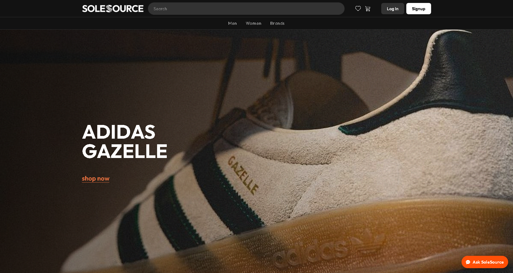

# SOLESOURCE Web Application

**Live demo:** http://dev.art2cart.shop



## Table of Contents
- Overview
- Core Features
- Tech Stack
- Architecture & Key Paths
- Data & Integrations
- Local Setup
- Environment Variables
- Database
- Running the App
- Background/Utility Scripts
- Admin Panel
- Testing & QA
- Deployment Notes
- Troubleshooting

## Overview
SoleSource is a PHP/MySQL e-commerce experience focused on premium sneakers. It includes product discovery, cart/checkout, authenticated profiles with wishlist and orders, admin management, and an AI assistant for guided shopping.

## Core Features
- Product catalog with search, filters, and brand/category groupings
- Product detail pages with size selection and recommendations
- Cart and checkout with address capture, delivery options, and payment method selection
- User accounts with profile, wishlist, saved addresses, and order history
- AI assistant chat entrypoint for contextual help
- Admin interface for products, orders, users, and settings

## Tech Stack
- PHP 8+, MySQL (mysqli)
- Bootstrap 5, Bootstrap Icons, Tom Select
- Vanilla JavaScript (Fetch, Bootstrap offcanvas/accordion)
- Composer-managed dependencies (PHPMailer)

## Architecture & Key Paths
- Public entry: [index.php](index.php)
- Pages: [pages](pages) (shop, product details, cart, checkout, profile, auth)
- Includes: [includes](includes) (layout, products, auth, cart, AI, orders, mail)
- Assets: [assets](assets) (css, js, img, svg, favicon)
- Admin: [admin](admin) (dashboard, CRUD, settings)
- Data fixtures: [data](data) (brand/product seed JSON)
- SQL schema/backups: [sql](sql)
- Vendor libraries: [vendor](vendor) (composer install)

## Data & Integrations
- Payments: PayPal client/secret (sandbox/live via env)
- Mail: SMTP credentials for PHPMailer
- AI assistant: provider keys and endpoint configured in env
- Optional SMS gateway keys if used

## Local Setup
Prerequisites: PHP 8+, MySQL 5.7+/8, Composer, a web server (Apache/Nginx) or php -S for development.

1) Install PHP dependencies:
```sh
composer install
```
2) Copy env template and configure:
```sh
cp .env.example .env
```
3) Create a MySQL database and import schema (see Database section).
4) Point your web server docroot to the project root (or use `php -S localhost:8000 -t .`).

## Environment Variables
Update `.env` with:
- `DB_HOST`, `DB_PORT`, `DB_NAME`, `DB_USER`, `DB_PASS`
- `PAYPAL_CLIENT_ID`, `PAYPAL_CLIENT_SECRET`, `PAYPAL_BASE_URL`
- `MAIL_HOST`, `MAIL_PORT`, `MAIL_USER`, `MAIL_PASS`, `MAIL_FROM_EMAIL`, `MAIL_FROM_NAME`
- AI-related keys/endpoints as required

## Database
- Schemas/backups: [sql](sql)
- Common import:
```sh
mysql -u <user> -p <db_name> < sql/complete.sql
```
- Set proper indexes/foreign keys included in the provided SQL dumps.

## Running the App
Development (PHP built-in):
```sh
php -S localhost:8000 -t .
```
Production-style (Apache/Nginx): point docroot to project root; ensure `mod_php` or PHP-FPM is configured. Sessions and uploads need writable temp directories.

## Background/Utility Scripts
- Auto-advance order statuses: `php scripts/auto-advance-orders.php`
- Email worker (queue processing): `php scripts/worker-email.php`
Schedule via cron/Task Scheduler as needed.

## Admin Panel
- Entry: [admin/index.php](admin/index.php)
- Protect with authentication/roles. Create an admin user in the database or seed accordingly.

## Testing & QA
- Manual flows: browse, filter, add to cart, checkout, profile updates, wishlist, orders.
- Validate PayPal sandbox transactions if enabled.
- Verify mail delivery via SMTP credentials.
- Run smoke tests on mobile widths for navigation, filters, and checkout drawer behavior.

## Deployment Notes
- Configure `.env` on the server; do not commit secrets.
- Set correct file permissions for cache/temp/upload directories if added.
- Use HTTPS and set secure session cookies in production.
- Ensure cron/Task Scheduler runs background scripts if using queues or status automation.

## Troubleshooting
- Blank pages: enable `display_errors` in a dev environment or check PHP error logs.
- DB connection issues: verify `DB_HOST`, port, user grants, and that mysqli extension is enabled.
- PayPal: confirm client/secret and base URL (sandbox vs live); check webhook settings if added.
- Email not sending: recheck SMTP creds/ports and PHPMailer debug logs.
- AI assistant: validate endpoint/key configuration and network egress from the server.
